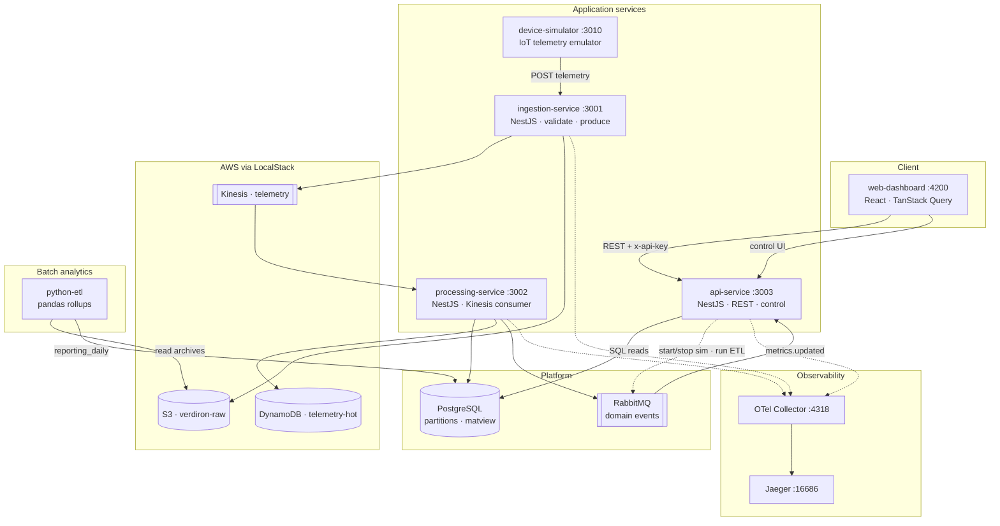

# Verdiron — Sustainability Module

Local-first **Node.js + TypeScript microservices** showcase for construction-fleet sustainability metrics: CO₂, fuel, idling waste, and utilization. Built to mirror a senior backend role (IoT ingest, stream processing, PostgreSQL + DynamoDB, AWS-shaped infra, React dashboard) without using any real company branding.

**Verdiron** is a fictional construction-tech platform. This repo implements the **Sustainability / Emissions** slice: telemetry flows in, metrics are computed, and a dashboard tells the story — all runnable on a laptop with Docker.

---

## Architecture



Full notes and flow list: [`docs/architecture/diagram.md`](docs/architecture/diagram.md)

**Flow:** simulator → ingestion → Kinesis + S3 → processing → Postgres aggregates + DynamoDB hot store → API → dashboard. Python ETL reads S3 archives into a reporting table. OpenTelemetry traces export to Jaeger.

Deep reference: [`memory-bank/`](memory-bank/) (architecture decisions, domain formulas, tickets).

---

## Skills → job requirements

| Requirement | Where it shows up |
|---|---|
| Node.js + TypeScript | Nx monorepo, strict TS, NestJS services |
| AWS (Kinesis, S3, DynamoDB, …) | Real `@aws-sdk` against **LocalStack**; Terraform modules in `infra/terraform/` |
| Microservices | `ingestion-service`, `processing-service`, `api-service`, simulator, Python ETL |
| Advanced SQL (PostgreSQL) | Range partitioning, window functions, materialized views (`libs/persistence`) |
| NoSQL | DynamoDB hot telemetry store |
| Message queues | RabbitMQ (NestJS transport) + Kinesis ingest stream |
| API design | REST, OpenAPI/Swagger, zod validation, API key auth |
| Docker | Per-app Dockerfiles + full `docker-compose.yml` stack |
| CI/CD + IaC | GitHub Actions (`.github/workflows/ci.yml`); Terraform for LocalStack |
| Data engineering / ETL | S3 archive → Python pandas rollups → Postgres `reporting_daily` |
| IoT / telematics | Device simulator with configurable fleet + emit rate |
| Polyglot | Python batch job alongside TypeScript services |

---

## Prerequisites

- **Docker Desktop** (Compose v2) — required for the one-command demo
- **Node.js 22** + npm — optional, for local Nx dev/test
- **Python 3.11+** — optional, for running ETL tests outside Docker
- **Terraform 1.5+** — optional, for IaC demo against LocalStack

---

## Quick start (full stack)

1. **Clone and configure env** (optional — compose defaults work):

   ```powershell
   Copy-Item .env.example .env
   ```

2. **Build and start everything:**

   ```powershell
   docker compose up -d --build
   ```

   First run pulls images and builds app containers (~5–15 min depending on machine). Migrations run automatically via the `db-migrate` service before app services start.

3. **Wait until healthy:**

   ```powershell
   docker compose ps
   ```

   Expect `api-service`, `ingestion-service`, `processing-service`, `web-dashboard`, and `device-simulator` to be up.

4. **Open the dashboard:**

   | Surface | URL |
   |---------|-----|
   | **Web UI** | http://localhost:4200 |
   | API (Swagger) | http://localhost:3003/docs |
   | Jaeger (traces) | http://localhost:16686 |
   | RabbitMQ mgmt | http://localhost:15672 (`verdiron` / `verdiron`) |

   Default API key (header `x-api-key`): `dev-api-key-change-me` — matches `.env.example`.

5. **Stop:**

   ```powershell
   docker compose down
   ```

---

## Demo tour (~5 minutes)

Use only the **web UI** — no manual DB or curl required.

1. **Control Panel** (`/control`)
   - Click **Start simulation** (e.g. fleet size 8, 2 events/sec).
   - Confirm status shows running; readiness indicators green.
   - Optional: **Run ETL** after ~30s of simulation (needs S3 archive data).

2. **Fleet Overview** (`/`)
   - KPI cards populate (CO₂, fuel, idle waste, utilization).
   - Change site / date range / bucket — chart and KPIs refresh.

3. **Asset Detail** (`/assets/{id}`)
   - Click an asset from the overview drilldown.
   - Inspect KPIs, history chart, recent telemetry table; try filters.

4. **Idling & Waste Report** (`/reports/idling`)
   - Ranked offenders table with estimated fuel cost.
   - Filter by site and period.

5. **Observability**
   - Open Jaeger → search service `ingestion-service` or `processing-service` → follow a trace from ingest through processing.

6. **Control Panel again**
   - **Stop simulation** when done.

---

## Sample data flows

### Live telemetry path

```
device-simulator → POST /telemetry (ingestion) → Kinesis + S3
                → processing-service consumer → metric engine
                → PostgreSQL (partitioned events + rollup matview)
                → DynamoDB (hot store)
                → api-service reads → dashboard charts
```

### Batch analytics path

```
S3 raw JSONL → python-etl (pandas rollups) → reporting_daily (Postgres)
             ← triggered from Control Panel via api-service + RabbitMQ
```

---

## Services & ports

| Service | Port | Role |
|---------|------|------|
| web-dashboard | 4200 | React UI |
| api-service | 3003 | Read + control API |
| ingestion-service | 3001 | Telemetry intake |
| processing-service | 3002 | Kinesis consumer + metrics |
| device-simulator | 3010 | IoT emulator |
| postgres | 5432 | Aggregates + SQL |
| rabbitmq | 5672 / 15672 | Domain events |
| localstack | 4566 | Kinesis, S3, DynamoDB |
| jaeger | 16686 | Trace UI |
| otel-collector | 4317 / 4318 | OTLP ingest |

---

## Local development (without full compose)

Run infra + migrations, then Nx for apps:

```powershell
docker compose up -d postgres rabbitmq localstack jaeger otel-collector
docker compose run --rm db-migrate
Copy-Item .env.example .env
npm install
# Start services in separate terminals:
npx nx serve ingestion-service
npx nx serve processing-service
npx nx serve api-service
npx nx serve device-simulator
npx nx serve web-dashboard
```

For unit/integration work:

```powershell
npx nx run-many -t test build --all --exclude=python-etl,@verdiron/source
```

Integration specs need Docker (`RUN_INTEGRATION_TESTS=true`).

---

## Terraform (LocalStack)

Declarative alternative to the shell init in `infra/localstack/ready.d/`:

```powershell
cd infra/terraform/localstack
terraform init
terraform plan

# If docker compose already created resources:
.\import-existing.ps1
terraform apply
```

Real-AWS VPC/ECS/EC2 shapes live commented in `infra/terraform/modules/real-aws-sketch/` — not deployed.

---

## CI

GitHub Actions runs on push/PR: ESLint, Nx typecheck, test, build, Python pytest, and Docker image builds. Deploy job is intentionally commented out (local-first project).

---

## Project layout

```
apps/           # ingestion, processing, api, simulator, web-dashboard
libs/           # domain, persistence, messaging, config, logger, tracing
jobs/python-etl # batch analytics
infra/          # docker, terraform, localstack init, otel
memory-bank/    # full design reference (not required to run the demo)
docs/           # architecture diagram (Mermaid)
```

---

## License

Private / unlicensed — portfolio showcase.
