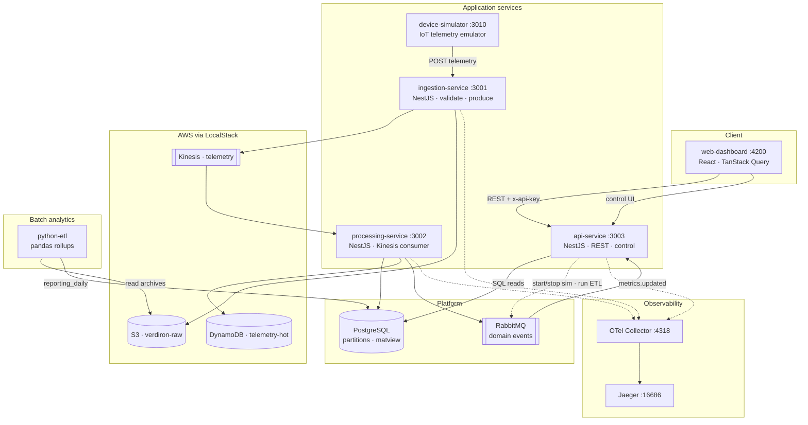

# Verdiron — System Architecture

Canonical architecture diagram for the Sustainability module. Renders on GitHub, in VS Code, and most Markdown viewers that support Mermaid.

## Diagram

## Primary flows

1. **Live telemetry** — simulator → ingestion → Kinesis + S3 → processing → PostgreSQL + DynamoDB → API → dashboard.
2. **Domain events** — processing publishes `metrics.updated` on RabbitMQ; API consumes for cache invalidation.
3. **Demo control** — dashboard control routes → API → RabbitMQ → simulator / Python ETL worker.
4. **Batch analytics** — Python ETL reads S3 JSONL, writes daily rollups to `reporting_daily`.
5. **Tracing** — all NestJS services export OpenTelemetry spans to the collector → Jaeger.

## Also see

- [`README.md`](../../README.md) — quick start and demo tour
- [`memory-bank/systemPatterns.md`](../../memory-bank/systemPatterns.md) — design decisions
